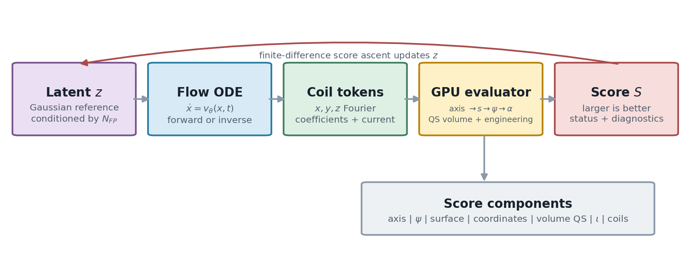
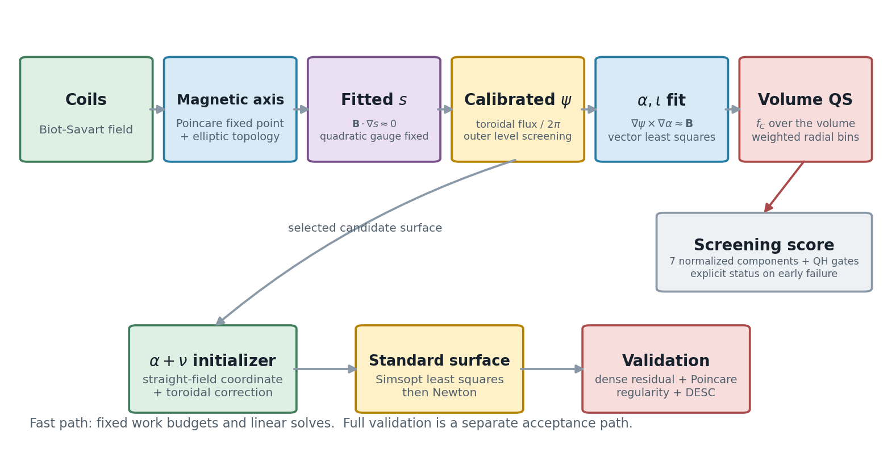
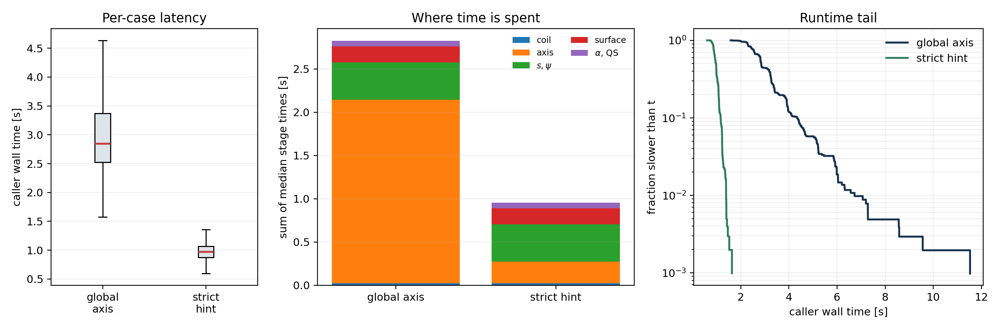
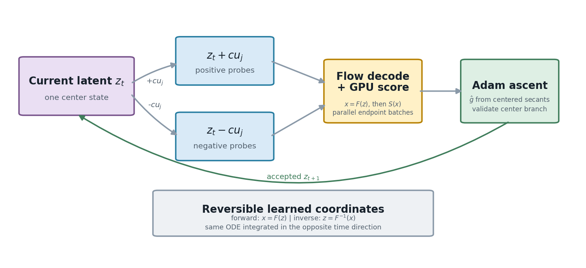

# StellCoilOpt

从 Fourier 线圈参数出发，以原生 C++/CUDA 完成磁轴、近似磁通坐标、候选磁面、体拟对称性和工程约束评估；同一套评分器可作为 Flow Matching 潜空间中的黑箱优化目标。

项目主页：<https://github.com/fancyovo/StellCoilOpt>



## 仓库内容

- `gpu_backend/`：ABI 10 原生 CUDA 评分器及 Python `ctypes` 接口。
- `stellarator_eval/`：磁轴、拟合不变量、磁通标定、Clebsch 坐标、体 QS、表面求解与可视化模块。
- `flow_matching/`：条件 Flow Matching 数据、Transformer、ODE 积分与几何损失。
- `scripts/`：单例/批量评分、数据导出、训练、反演、潜空间 Adam、`alpha+nu` 初始化、标准磁面和 DESC 验证入口。
- `evaluation/full_physical/`：从候选面中选择最大连续可接受磁面的规则与完整评估顺序。
- `tests/`：不依赖项目数据或模型权重的单元测试。

仓库不包含数据集、训练权重、原始 benchmark 结果、运行日志、集群提交脚本、历史探索记录或私有基础设施配置。下文仅保留一张汇总后的性能图，用于说明当前实现的耗时结构。

## 方法主线



快速评分路径按固定预算执行：

1. 对一个场周期的 Poincare 映射批量求固定点，并保留满足椭圆拓扑条件的磁轴。
2. 在磁轴附近拟合满足 $\mathbf B\cdot\nabla s\approx0$ 的多项式-Fourier 不变量；固定 $X^2$ 的常数 Fourier 系数为 1，消除齐次方程的零解与尺度规范。
3. 沿极射线求 $s$ 等值面，追踪磁力线筛选可用外层面，并用环向磁通 $\Phi_t/(2\pi)$ 把 $s$ 标定为 $\psi$。
4. 在体采样点上以向量最小二乘拟合 $\mathbf B\approx\nabla\psi\times\nabla\alpha$，其中 $\alpha=\theta+\lambda-\iota\phi$，随后计算体 QS 残差与工程量。
5. 将磁轴、 $\psi$、磁面、坐标、体 QS、 $\iota$ 和线圈工程七部分合成为 $[0,100]$ 分数，并显式返回失败状态。

完整物理接受是独立路径：从候选面构造 $\alpha+\nu$ 初值，运行 Simsopt 标准最小二乘与 Newton，随后检查独立稠密网格、Poincare、坐标正则性、体积单调性和 DESC。快速分数不能替代这一步。

公式、规范自由度、采样权重、精确评分构成和数值边界见 [技术方法](docs/method.md)。

## 环境

基础 Python 包需要 Python 3.10+、NumPy 和 SciPy：

```bash
python -m venv .venv
python -m pip install -U pip
python -m pip install -e ".[plot,dev]"
```

训练 Flow 需要 `.[train]`；标准 Boozer 面和完整验证需要 `.[simsopt]`，DESC 需按其官方安装方式另行安装。原生评分器需要支持 C++17 的主机编译器、CMake 3.22+、CUDA Toolkit、cuBLAS 和 cuSOLVER。

## 构建 CUDA 后端

```bash
cmake -S gpu_backend -B gpu_backend/build_native_score \
  -DCMAKE_BUILD_TYPE=Release
cmake --build gpu_backend/build_native_score --parallel
```

多架构环境可额外设置 `-DCMAKE_CUDA_ARCHITECTURES=<compute capability>`。Linux 默认库路径为 `gpu_backend/build_native_score/libstellarator_gpu.so`；其他平台通过下述命令的 `--lib` 参数传入实际产物路径。

## 输入格式

一个基础线圈由三个 33 项 Fourier 数组和一个电流表示。每个坐标数组的顺序为

```text
[c0, s1, c1, s2, c2, ..., s16, c16]
```

最小 JSON 结构为：

```json
{
  "raw": {
    "x": [[1.0, 0.0, 0.2]],
    "y": [[0.0, 0.2, 0.0]],
    "z": [[0.0, 0.0, 0.1]],
    "current": [1.0],
    "current_unit": "A"
  },
  "nfp": 4
}
```

实际 `x/y/z` 每行必须同为奇数长度；原生训练/Flow 路径使用 33 项。`nfp` 个场周期和 stellarator symmetry 由评估器展开，不应在输入中重复所有对称线圈。`examples/01.json` 是完整的格式示例，不代表基准结果。

## 原生评分

单例 QH 评分：

```bash
python scripts/smoke_native_score.py examples/01.json \
  --target QH \
  --lib gpu_backend/build_native_score/libstellarator_gpu.so
```

批量评分入口为 `scripts/batch_native_score.py`。它支持按 worker 索引分片，适合由外部任务系统启动一个持久进程对应一块 GPU；仓库不绑定任何特定调度器。

## 性能 benchmark



图中汇总 1024 个 QUASR QH 样本在两张 RTX 5090 上的当前原生评分耗时。`global axis` 对每个独立样本执行全局磁轴搜索；`strict hint` 用于局部优化端点，只允许沿用中心样本已验证的磁轴分支，分支丢失即失败，不切换到另一根磁轴。1013 个可配对样本的单次调用耗时中位数分别为 2.85 s 和 0.97 s，配对中位加速为 2.99 倍。箱图与右侧尾分布表明严格延续同时降低典型耗时并收缩长尾；中间的阶段分解显示主要节省来自磁轴搜索，其余评分阶段的工作量基本不变。

## Flow Matching

数据导出、校验、训练和反演是分离步骤：

```bash
python scripts/export_quasr_qh_flow.py \
  --quasr-root external/quasr \
  --metadata external/metadata.json \
  --output-dir data/qh_flow

python scripts/verify_qh_flow_dataset.py --data-dir data/qh_flow

torchrun --standalone --nproc-per-node=4 scripts/train_qh_flow.py \
  --data-dir data/qh_flow \
  --output-dir runs/flow

python scripts/invert_qh_flow_latents.py \
  --data-dir data/qh_flow \
  --checkpoint runs/flow/checkpoint_latest.pt \
  --output-dir runs/inverted
```

训练目标使用直线概率路径 $x_t=(1-t)z+t x$ 和速度目标 $x-z$。默认 Transformer 对线圈 token 不加位置编码，因此线圈排列不改变模型含义； $N_{\rm FP}$ 通过条件嵌入输入。ODE 使用同一速度场正向生成、反向求潜变量。

## 潜空间黑箱优化



```bash
python scripts/optimize_flow_latent.py \
  --checkpoint runs/flow/checkpoint_latest.pt \
  --out-dir runs/optimized \
  --lib gpu_backend/build_native_score/libstellarator_gpu.so \
  --target QH --nfp 4 --n-base-coils 3 \
  --gpus 0,1,2,3
```

每步在正交方向上计算中心差分，以标准 Adam 做分数上升。端点评分使用当前中心的严格磁轴延续提示；分支丢失返回 `branch_lost`，不会静默切换磁轴。无效端点、异常梯度尺度和无效更新中心都有有界处理，运行可由 `--resume` 从完整 Adam 状态继续。

## 完整物理验证

完整路径依赖 Simsopt，DESC 为最终可选阶段。入口和文件传递关系见 [完整评估说明](evaluation/full_physical/README.md)。核心顺序是：

```text
stellcoilopt-eval -> fit_alpha.py -> fit_nu.py
                 -> solve_boozer_surface.py
                 -> select_largest_standard_surface.py
                 -> evaluate_surface.py
```

每个新样本都必须独立选择拟合半径 `a` 和候选 `s` 阶梯。不得把其他样本的外层面参数当作固定默认值。

## 验证

```bash
python -m compileall -q .
python -m pytest -q
python tools/render_docs.py
```

CUDA 数值测试需要已构建的动态库和可用 GPU；Simsopt/DESC 测试只在安装对应可选依赖后运行。

## 许可证

本项目采用 [MIT License](LICENSE)。
