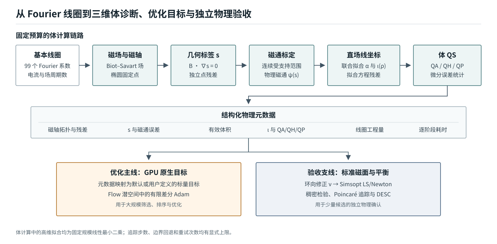

# StellCoilOpt

StellCoilOpt 从 Fourier 线圈参数出发，在 C++/CUDA 中完成磁轴、三维体坐标、微分准对称性和线圈工程量评估，并用固定预算的 Flow 潜空间优化搜索准螺旋对称线圈。

完整的方法定义、实验协议和定量结果见唯一的公开研究文档：[技术报告](docs/technical-report.md)。



当前公开主线与技术报告中的 309 条 QH 优化轨迹使用同一协议：32 个 Flow 候选筛选起点、64 个正交方向的中心差分、200 步 Adam，以及 FP32 RK4-128。快速评分用于高吞吐筛选和优化；Simsopt 与 DESC 用于少量候选的独立物理验收。

## 快速开始

当前实现面向 Linux 和 NVIDIA GPU。基础 Python 环境与 CUDA 后端可按以下方式安装和构建：

```bash
python -m venv .venv
source .venv/bin/activate
python -m pip install --upgrade pip
python -m pip install -e ".[plot,train,dev]"

cmake -S gpu_backend -B gpu_backend/build_native_score \
  -DCMAKE_BUILD_TYPE=Release
cmake --build gpu_backend/build_native_score --parallel
```

Linux 默认产物为 `gpu_backend/build_native_score/libstellarator_gpu.so`。用仓库内示例运行一次独立 QH 评分：

```bash
python scripts/smoke_native_score.py examples/01.json \
  --target QH \
  --lib gpu_backend/build_native_score/libstellarator_gpu.so
```

这个命令不需要 Flow 权重。Flow 筛选与优化需要自行准备训练数据和检查点；Simsopt 与 DESC 只在完整验收阶段需要。

## 仓库内容

- `gpu_backend/`：原生 CUDA 评分器、批量近邻评分内核和 Python `ctypes` 绑定。
- `stellarator_eval/`：正式评分接口、近邻批量接口、体坐标、标准磁面和可视化模块。
- `flow_matching/`：条件 Flow Matching 模型、数据归一化、ODE 积分和已验证优化协议。
- `scripts/`：评分、Flow 数据准备与训练、32 候选筛选、64 方向 Adam、标准磁面和 DESC 入口。
- `evaluation/full_physical/`：候选的完整物理验收流程。
- `tests/`：不依赖私有数据或训练权重的接口与数值单元测试。

仓库不包含 QUASR 数据、训练权重、逐次实验数组、运行日志、集群提交脚本或私有基础设施配置。

## 数值主线

正式体评分按以下顺序执行：

1. 对一个场周期的 Poincare 映射批量求固定点，并保留满足椭圆拓扑条件的磁轴。
2. 在磁轴附近线性拟合满足 $\boldsymbol B\cdot\nabla s\approx0$ 的多项式-Fourier 几何标签 $s$ 。
3. 连续选择可用边界，并由截面环量标定物理磁通 $\psi(s)$ 。
4. 在体采样点上联合线性拟合 $\alpha$ 与三次 $\iota(\psi/\psi_{\mathrm{edge}})$ 。快速评分使用切向标量方程；完整验收支线使用向量 Clebsch 关系拟合 $\alpha+\nu$ 初值。
5. 计算体 QA/QH/QP、有效体积、旋转变换和线圈工程量，并返回结构化元数据与默认 0--100 分数。

快速分数是筛选与优化目标，不是标准磁面或 MHD 平衡存在性的证明。少量候选仍需运行 Simsopt LS/Newton、独立稠密检验、Poincare 追踪和 DESC。

## 输入格式

每根基本线圈的 `x/y/z` 均使用奇数长度的实 Fourier 系数数组，电流单位必须显式给出。Flow 模型使用每个坐标 33 项，加一个电流，因此一根线圈对应 100 维 token。

```json
{
  "raw": {
    "x": [[1.0, 0.0, 0.2]],
    "y": [[0.0, 0.2, 0.0]],
    "z": [[0.0, 0.0, 0.1]],
    "current": [1000000.0],
    "current_unit": "A"
  },
  "nfp": 4
}
```

`nfp` 个场周期和 stellarator symmetry 由评估器展开，输入中不应重复所有对称线圈。`examples/01.json` 是完整格式示例，不代表性能基准。

## 正式评分接口

Python 接口将数值模式和分数策略分开：

```python
from stellarator_eval import CoilSet, EvaluationMode, Evaluator

coils = CoilSet(coeffs_x, coeffs_y, coeffs_z, currents_a, nfp=4)
evaluator = Evaluator("gpu_backend/build_native_score/libstellarator_gpu.so")

initial = evaluator.evaluate(coils, mode=EvaluationMode.INDEPENDENT)
continued = evaluator.evaluate(
    nearby_coils,
    mode=EvaluationMode.STRICT_CONTINUATION,
    continuation=initial.continuation_state(),
)
```

`Evaluator` 的两种模式都是正式评分：

- `independent` 从线圈全局搜索磁轴，适合独立样本、随机起点和最终复评。
- `strict_continuation` 只接受给定初值附近的同一磁轴分支，但完整重算其余物理量；分支不满足条件时返回 `branch_lost`，不会切换到另一根磁轴。

`NeighborhoodEvaluator` 以一个正式中心为锚，批量评价附近有限差分端点。它会重算候选磁轴、 $s$ 、边界、 $\psi$ 、 $\alpha/\iota$ 和体 QS 的局部近似，但继承坐标分量并线性化线圈工程分量。其输出用于端点排序和方向导数；每个接受的新中心必须再经过 `strict_continuation` 正式评分。

`EvaluationResult` 同时保存 `native_score`、七个分数组成、原始诊断量、逐阶段耗时、状态和调用配置。可用 `WeightedComponentPolicy` 或任意可调用对象从同一元数据构造用户分数，而不修改物理计算。

## 已验证 QH 优化

公开默认配置与技术报告中的 309 条优化轨迹一致，不使用历史两方向 SPSA：

- 先独立评价 32 个 Flow 候选并选择最高有效分起点；
- 运行 200 个 Adam 更新；
- 每步生成 64 个新正交方向，以 $h=0.005$ 计算 128 个中心差分端点；
- 端点使用单卡近邻批量评分，接受中心使用严格续接正式评分；
- Adam 使用 $\eta=0.02$ 、 $\beta_1=0.7$ 、 $\beta_2=0.999$ ；
- Flow 使用 FP32 RK4-128。

先筛选起点：

```bash
python scripts/screen_flow_starts.py \
  --checkpoint runs/flow/checkpoint_latest.pt \
  --lib gpu_backend/build_native_score/libstellarator_gpu.so \
  --out-dir runs/qh_nfp4_nc3/screen \
  --nfp 4 --n-base-coils 3 --seed 1
```

再从选中起点优化；下列命令不覆盖任何协议参数，因为 CLI 默认值已经锁定为上述配置：

```bash
python scripts/optimize_flow_latent.py \
  --checkpoint runs/flow/checkpoint_latest.pt \
  --initial-case runs/qh_nfp4_nc3/screen/selected_start.json \
  --lib gpu_backend/build_native_score/libstellarator_gpu.so \
  --out-dir runs/qh_nfp4_nc3/optimization \
  --nfp 4 --n-base-coils 3 \
  --flow-device 0 --score-device 0
```

一条轨迹使用一张 GPU。扩展到多卡时，应由外部调度器让不同轨迹各占一张卡，而不是让单条轨迹隐式改变协议。

## Flow 训练

```bash
python scripts/export_quasr_qh_flow.py \
  --quasr-root external/quasr \
  --metadata external/metadata.json \
  --output-dir data/qh_flow

python scripts/verify_qh_flow_dataset.py --data-dir data/qh_flow

torchrun --standalone --nproc-per-node=4 scripts/train_qh_flow.py \
  --data-dir data/qh_flow \
  --output-dir runs/flow
```

训练目标采用直线概率路径。Transformer 对线圈 token 使用非因果注意力且不加位置编码， $N_{\mathrm{FP}}$ 通过条件嵌入输入。训练数据的使用与再分发必须遵守其原始许可。

## 完整物理验收

完整路径依赖 Simsopt，DESC 为最终可选阶段。入口和文件传递规则见 `evaluation/full_physical/README.md`，核心顺序为：

```text
fit_alpha.py -> fit_nu.py -> solve_boozer_surface.py
             -> select_largest_standard_surface.py -> evaluate_surface.py
```

每个新样本必须独立选择源拟合半径和候选磁面阶梯，不得复用另一样本的固定半径或标签值。完整验收应保存分数组成、面 QA/QH/QP、 $|B|$ 等高线、Poincare、三维线圈与磁面，以及可用的全部 DESC 诊断图。

## 验证

```bash
python -m compileall -q flow_matching stellarator_eval scripts gpu_backend/python
python -m pytest -q
```

Python 单元测试不需要模型权重。CUDA 数值测试需要已构建的动态库和可用 GPU；Simsopt/DESC 测试只在安装对应可选依赖后运行。

## 许可证

本项目采用 [MIT License](LICENSE)。
